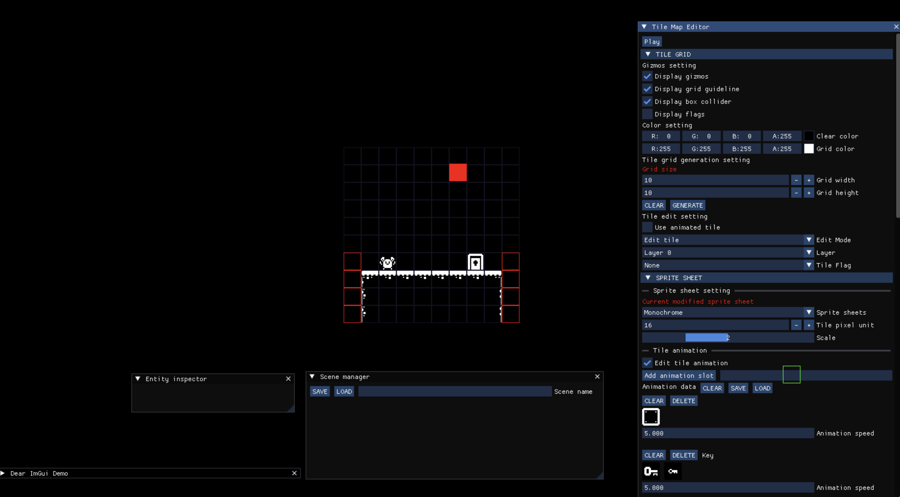

# MELT 2D Game Engine  

MELT Engine is a simple 2D tile-based game engine built with **SDL2**, **ImGui**, **nativefiledialog-extended**, and **yaml-cpp**.  





## Features  
- **Tile-Based Scene System**: Save and load scenes as YAML files.  
- **Tile Editor**: Create and modify tile-based levels with an integrated editor.  
- **Tile Animation Support**: Easily animate tiles for dynamic environments.  

## How to Build  
1. Clone the repository:  
   ```sh
   git clone https://github.com/Fusamamu/MELT_ENGINE2D.git
   cd MELT_ENGINE2D
   
3. **Build the Engine:**
   ```bash
   mkdir build
   cd build
   cmake ..
   make
   ```
